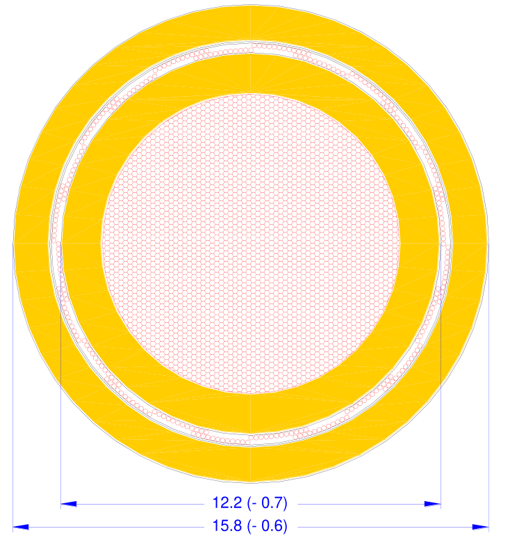

HV Cables
=========

Coroflex FHLR2GCB2G
###################

:download:`Datasheet <_pdf/coroflex_FHLR2GCB2G.pdf>`

    HV Cable Cross-Section (dimensions in mm)

+--------------------------------------------+
| Bend radius                                |
+=======================+====================+
| Static installation   | 3 x Outer Diameter |
+-----------------------+--------------------+
| Dynamic installation  | 6 x Outer Diameter |
+-----------------------+--------------------+

Resources
#########
* :download:`Comprehensive Guide to Good Crimping (Cablecraft) <_pdf/cablecraft_crimp_guide.pdf>`