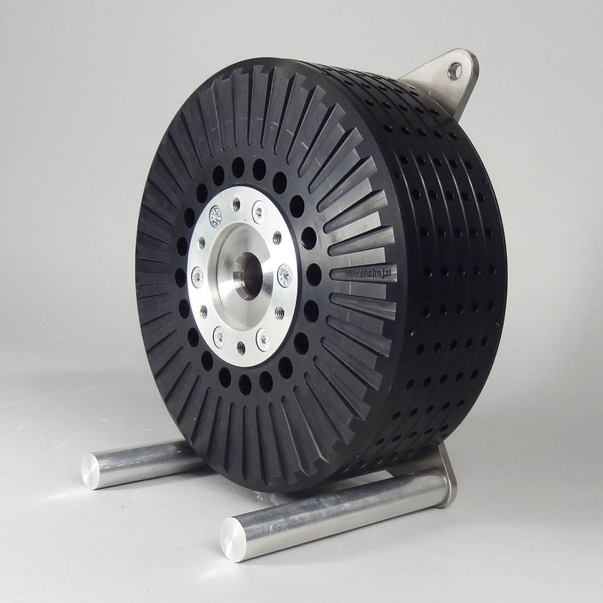
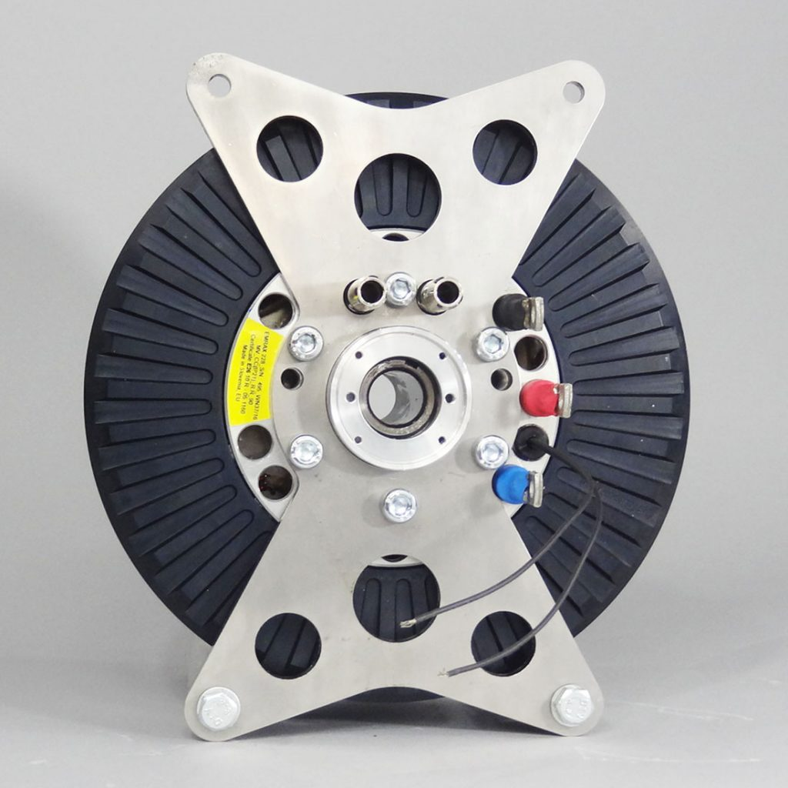
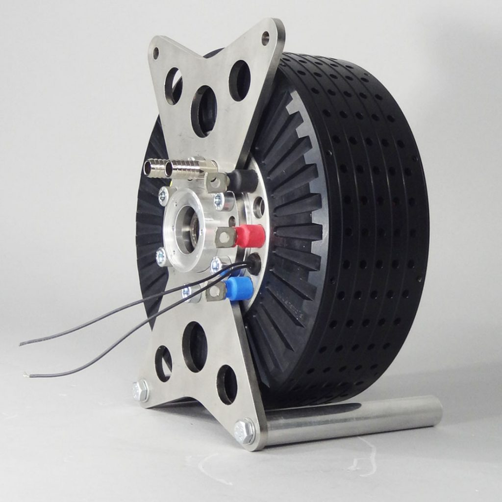

Motor - Emrax 228
=================

We use the `Emrax 228 High Voltage motor <https://emrax.com/e-motors/emrax-228>`_. This is used as part of our single
motor drivetrain and is watercooled.

Resources
---------

| :download:`Technical Sheet <_pdf/emrax-228-technical-sheet.pdf>`
| Contains key numbers / graphs

| :download:`Manual <_pdf/emrax-228-manual.pdf>`
| Covers everything from technical drawings to installation and maintence

To Add
------
- Resources on resolver
- Details on connecting to the motor
- Temperature probe
- Diagram showing connections (including phase UVW etc...)
- Resolver calibration (see inverter)
